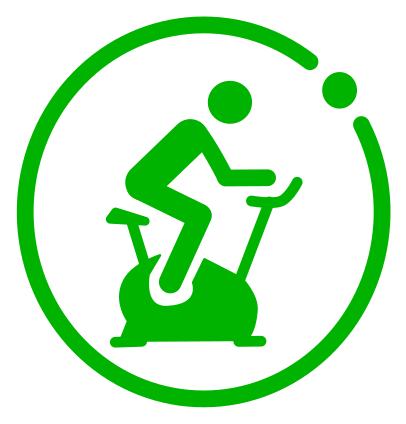

<h1 align="center">🚴 HomeBiker — Carnet de séances de vélo d'appartement</h1>

  <a href="https://herveheritier.github.io/vanillajs-home-biker/"><strong>▶ Ouvrir l'application en ligne</strong></a>

  

Une application **100 % locale** (aucun serveur, aucune dépendance) pour consigner
vos **séances de vélo d'appartement** : date, horaires, kilométrage et force de résistance.
Vos données restent dans votre navigateur.

> 💡 **Pourquoi un compteur kilométrique ?** On est immobile, mais le compteur du vélo,
> lui, tourne. Chaque séance enregistre la valeur du compteur **au début** et **à la
> fin** : la distance pédalée est calculée automatiquement, et les séances se
> **chaînent** naturellement d'une fois sur l'autre (le compteur ne revient pas en
> arrière).

---

## ✨ Fonctionnalités

- **Saisie guidée** : date du jour pré-remplie, compteur de début reporté
  automatiquement sur la séance suivante, **distance calculée en direct**
- **Statistiques** : nombre de séances, distance totale, durée cumulée et
  vitesse moyenne
- **Force de résistance** : curseur de 0 à 8 avec badge coloré
- **Édition en ligne** : corrigez une séance directement dans le tableau ; la
  distance se recalcule si vous changez le compteur de fin
- **Propagation intelligente** : si la séance suivante était chaînée (son
  compteur de début = votre ancienne fin), l'app propose de répercuter la
  correction ; une **incohérence (distance négative) est signalée avant toute
  modification**
- **Export / import CSV** : compatible Excel/LibreOffice (`;`, BOM UTF-8,
  virgules décimales tolérées), avec le **nom de l'utilisateur** sur chaque
  ligne ; fusion avec détection des doublons ou remplacement complet
- **Multi-profils** : chaque utilisateur a son carnet isolé, avec
  ajout/renommage/suppression, et une **vue consolidée** de tous les carnets
  (statistiques, récapitulatif par utilisateur, détail de toutes les séances)
- **Confort** : mode sombre automatique, responsive (mobile), notifications
  non bloquantes, modales clavier (Entrée / Échap), séances les plus
  récentes affichées en premier

## 📖 Mode d'emploi

### Consigner une séance
1. Renseignez la **date**, l'**heure de début** et l'**heure de fin**.
2. Notez le **compteur au début** puis **à la fin** de la séance — la distance
   s'affiche au fil de la saisie (une alerte apparaît si la fin est inférieure
   au début).
3. Ajustez la **force de résistance** avec le curseur.
4. Cliquez sur **＋ Ajouter la séance**. À la séance suivante, la date et le
   compteur de début sont déjà remplis pour vous.

### Corriger une séance
Cliquez sur **✎** dans la ligne du tableau : le compteur de début est
verrouillé (valeur de fin de la séance précédente). Modifiez le compteur de
fin → la distance se recalcule. Si la séance suivante était chaînée à
celle-ci, l'app vous propose de **répercuter la correction** ; si la
correction créerait une distance négative, elle est **bloquée et signalée**
avant modification.

### Exporter / importer
- **⬇ Exporter en CSV** : télécharge `carnet-<profil>-<date>.csv` (ouvrable
  dans Excel/LibreOffice). Chaque ligne comporte le **nom de l'utilisateur**
  en première colonne.
- **⬆ Importer un CSV** : accepte un fichier exporté par l'app (nouveaux
  en-têtes *Compteur début/fin* ou anciens *Km départ/arrivée*) ou un CSV
  « maison » (séparateur `;` ou `,` détecté automatiquement). Si le fichier
  comporte une colonne **Utilisateur**, les séances sont réparties dans les
  profils correspondants (les profils inconnus sont créés après
  confirmation) ; sinon tout va dans le carnet de l'utilisateur actif. Si
  votre carnet n'est pas vide, vous choisissez **fusionner** (les doublons
  sont ignorés) ou **remplacer**.

### Vue consolidée
Le bouton **👥 Vue consolidée** affiche le carnet de tous les utilisateurs :
statistiques globales, récapitulatif par utilisateur et détail de toutes les
séances (les plus récentes d'abord). De là :
- **⬇ Exporter tout en CSV** : télécharge
  `carnet-tous-utilisateurs-<date>.csv`, un fichier unique avec la colonne
  Utilisateur remplie pour chaque séance.
- **⬆ Importer un CSV multi-profils** : réimporte un tel fichier en
  restaurant chaque carnet (y compris la création des profils manquants).

### Gérer les profils
Dans la barre en haut : sélectionnez l'utilisateur actif, **＋** ajoute un
profil, **✎** renomme, **🗑** supprime (les séances du profil sont effacées —
une confirmation est demandée). Le premier lancement migre automatiquement
un éventuel ancien carnet unique vers le profil « Moi ».

## 🔒 Données & confidentialité

Tout est stocké dans le **localStorage de votre navigateur** : rien ne sort
de votre machine, aucun compte, aucun tracker. Pensez à faire un **export
CSV** de temps en temps comme sauvegarde (un changement de navigateur ou de
machine ne conserve pas les données locales) — l'**export global** depuis la
vue consolidée sauvegarde tous les carnets en un seul fichier.

## 🛠 Technique

Un seul fichier [`index.html`](index.html) — HTML/CSS/JS vanilla, sans
framework ni build. Hébergé gratuitement via **GitHub Pages**.

## 📄 Licence

Distribué sous [licence MIT](LICENSE).

---

  En ligne : <a href="https://herveheritier.github.io/vanillajs-home-biker/">herveheritier.github.io/vanillajs-home-biker</a>

