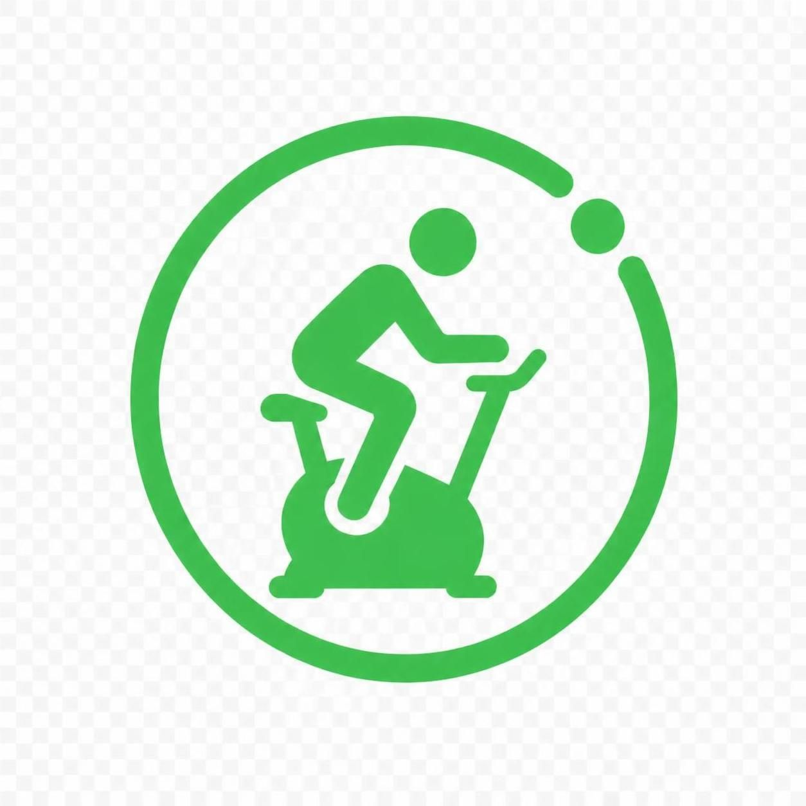

<h1 align="center">🚴 HomeBiker — Carnet de trajets vélo</h1>

  <a href="https://herveheritier.github.io/vanillajs-home-biker/"><strong>▶ Ouvrir l'application en ligne</strong></a>

  

Une application **100 % locale** (aucun serveur, aucune dépendance) pour consigner
vos trajets à vélo : date, horaires, kilométrage, effort ressenti. Vos données
restent dans votre navigateur.

---

## ✨ Fonctionnalités

- **Saisie guidée** : date du jour pré-remplie, kilométrage de départ reporté
  automatiquement sur la saisie suivante, **distance calculée en direct**
- **Statistiques** : nombre de trajets, distance totale, durée cumulée et
  vitesse moyenne
- **Force de l'effort** : curseur de 0 à 8 avec badge coloré
- **Édition en ligne** : corrigez une ligne directement dans le tableau ; la
  distance se recalcule si vous changez le km d'arrivée
- **Propagation intelligente** : si la ligne suivante était chaînée (son départ
  = votre ancienne arrivée), l'app propose de répercuter la correction ; une
  **incohérence (distance négative) est signalée avant toute modification**
- **Export / import CSV** : compatible Excel/LibreOffice (`;`, BOM UTF-8,
  virgules décimales tolérées), fusion avec détection des doublons ou
  remplacement complet
- **Multi-profils** : chaque utilisateur a son carnet isolé, avec
  ajout/renommage/suppression
- **Confort** : mode sombre automatique, responsive (mobile), notifications
  non bloquantes, modales clavier (Entrée / Échap)

## 📖 Mode d'emploi

### Saisir un trajet
1. Renseignez la **date**, les **heures** de départ et d'arrivée.
2. Entrez le **km au départ** puis le **km à l'arrivée** — la distance
   s'affiche au fil de la saisie (une alerte apparaît si l'arrivée est
   inférieure au départ).
3. Ajustez la **force** ressentie avec le curseur.
4. Cliquez sur **＋ Ajouter le trajet**. Au trajet suivant, la date et le
   compteur de départ sont déjà remplis pour vous.

### Corriger une ligne
Cliquez sur **✎** dans la ligne du tableau : le km de départ est verrouillé
(valeur de la ligne précédente). Modifiez le km d'arrivée → la distance se
recalcule. Si la ligne suivante était chaînée à celle-ci, l'app vous propose
de **répercuter la correction** ; si la correction créerait une distance
négative, elle est **bloquée et signalée** avant modification.

### Exporter / importer
- **⬇ Exporter en CSV** : télécharge `carnet-<profil>-<date>.csv` (ouvrable
  dans Excel/LibreOffice).
- **⬆ Importer un CSV** : accepte un fichier exporté par l'app ou un CSV
  « maison » (séparateur `;` ou `,` détecté automatiquement). Si votre carnet
  n'est pas vide, vous choisissez **fusionner** (les doublons sont ignorés)
  ou **remplacer**.

### Gérer les profils
Dans la barre en haut : sélectionnez l'utilisateur actif, **＋** ajoute un
profil, **✎** renomme, **🗑** supprime (les trajets du profil sont effacés —
une confirmation est demandée). Le premier lancement migre automatiquement
un éventuel ancien carnet unique vers le profil « Moi ».

## 🔒 Données & confidentialité

Tout est stocké dans le **localStorage de votre navigateur** : rien ne sort
de votre machine, aucun compte, aucun tracker. Pensez à faire un **export
CSV** de temps en temps comme sauvegarde (un changement de navigateur ou de
machine ne conserve pas les données locales).

## 🛠 Technique

Un seul fichier [`index.html`](index.html) — HTML/CSS/JS vanilla, sans
framework ni build. Hébergé gratuitement via **GitHub Pages**.

## 📄 Licence

Distribué sous [licence MIT](LICENSE).

---

  En ligne : <a href="https://herveheritier.github.io/vanillajs-home-biker/">herveheritier.github.io/vanillajs-home-biker</a>

