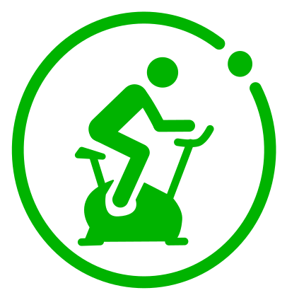

<h1 align="center">🚴 HomeBiker — Carnet de séances de vélo d'appartement</h1>

  <a href="https://herveheritier.github.io/vanillajs-home-biker/"><strong>▶ Ouvrir l'application en ligne</strong></a>

  

Une application **100 % locale** (aucun serveur, aucune dépendance) pour consigner
vos **séances de vélo d'appartement** : date, horaires, kilométrage et force de résistance.
Vos données restent dans votre navigateur.

> 💡 **Pourquoi un compteur kilométrique ?** On est immobile, mais le compteur du vélo,
> lui, tourne. Chaque séance enregistre la valeur du compteur **au début** et **à la
> fin** : la distance pédalée est calculée automatiquement, et les séances se
> **chaînent** naturellement d'une fois sur l'autre (le compteur ne revient pas en
> arrière).

---

## ✨ Fonctionnalités

- **Saisie guidée** : date du jour pré-remplie, compteur de début reporté
  automatiquement sur la séance suivante, **distance calculée en direct** ;
  l'heure de fin et le compteur de fin sont pré-remplis avec ceux de début
  (il suffit de les ajuster) ; si vous changez la date/l'heure (rattrapage
  d'une séance oubliée), le compteur de début est repris de la séance qui
  **précède chronologiquement** le moment saisi, et la séance ajoutée
  retrouve sa place dans le carnet
- **Chrono de séance** : onglet **⏱ Chrono** du formulaire — **Démarrer**
  lance le minuteur, **Arrêter** le stoppe et bascule sur l'onglet de saisie
  avec **date et horaires pré-remplis** (heure de début = départ du chrono,
  heure de fin = arrêt) ; il ne reste que le compteur et la force à ajuster
- **Statistiques** : nombre de séances, distance totale, durée cumulée et
  vitesse moyenne
- **Graphique de progression** : barres de distance et courbe de vitesse
  séance par séance (SVG natif, infobulles au survol, période affichée
  réglable — 10/30 dernières ou tout) ; affiché aussi dans la vue consolidée.
  Chaque séance porte également un **trait vertical** lu sur l'axe des heures
  (0 h en bas → 24 h en haut, repères 6/12/18 h) ; une séance qui traverse
  minuit est dessinée en **deux segments** (fin de soirée + début de nuit)
  au lieu d'un trait trompeur couvrant toute la journée. La **légende est
  cliquable** : chaque élément (Distance, Vitesse, Plage horaire) masque ou
  réaffiche sa couche sur le graphe, avec préférence mémorisée
- **Force de résistance** : curseur de 0 à 8 avec badge coloré
- **Édition en ligne** : corrigez une séance directement dans le tableau ; la
  distance se recalcule si vous changez le compteur de fin
- **Propagation intelligente** : si la séance suivante était chaînée (son
  compteur de début = votre ancienne fin), l'app propose de répercuter la
  correction ; une **incohérence (distance négative) est signalée avant toute
  modification**
- **Export / import CSV** : compatible Excel/LibreOffice (`;`, BOM UTF-8,
  virgules décimales tolérées), avec le **nom de l'utilisateur** sur chaque
  ligne ; fusion avec détection des doublons ou remplacement complet
- **Coffre de secours** : sauvegarde **complète** (tous les profils, tous les
  carnets, préférences) en un clic, **hors du navigateur** — fichier daté,
  partage natif, copie de texte ou **QR code** ; restauration par fichier,
  texte collé, scan QR **ou réception d'un coffre partagé depuis une autre
  application**, avec **fusion anti-doublons** ou remplacement ; bandeau de
  rappel discret après chaque modification (indispensable dans les
  navigateurs qui effacent le stockage à la fermeture)
- **Application installable (PWA)** : bouton « ⬇ Installer l'application »
  (ou « 📲 Installer ») — une fois installée sur l'écran d'accueil, l'app
  tourne **hors-ligne** dans sa propre fenêtre et son stockage devient
  **persistant** (protection contre les purges de type Safari/ITP)
- **Copie de secours locale (IndexedDB)** : chaque sauvegarde est aussi
  écrite dans une **seconde base** du navigateur ; si le localStorage est
  purgé, le carnet est **reconstruit automatiquement** au démarrage suivant
- **Filet de sortie** : en cas de fermeture d'onglet avec des modifications
  non sauvegardées, l'app tente un **export automatique du coffre** (si le
  navigateur l'autorise) — le fichier se retrouve dans Téléchargements
- **Multi-profils** : chaque utilisateur a son carnet isolé, avec
  ajout/renommage/suppression, et une **vue consolidée** de tous les carnets
  (statistiques, récapitulatif par utilisateur, détail de toutes les séances)
- **Confort** : mode sombre automatique, responsive (mobile), notifications
  non bloquantes, modales clavier (Entrée / Échap), séances les plus
  récentes affichées en premier

## 📖 Mode d'emploi

### Consigner une séance
1. Renseignez la **date**, l'**heure de début** et l'**heure de fin**.
2. Notez le **compteur au début** puis **à la fin** de la séance — la distance
   s'affiche au fil de la saisie (une alerte apparaît si la fin est inférieure
   au début).
3. Ajustez la **force de résistance** avec le curseur.
4. Cliquez sur **＋ Ajouter la séance**. À la séance suivante, la date et le
   compteur de début sont déjà remplis pour vous.

Les champs se suivent automatiquement : le **compteur de début** est repris
du compteur de fin de la séance qui précède la date/heure saisies — pratique
pour consigner une séance oubliée au milieu du carnet — et **l'heure de fin**
ainsi que le **compteur de fin** partent de la valeur des champs de début.
Toute saisie manuelle reste prioritaire (effacez le champ pour réactiver
l'automatisme).

### Chronométrer une séance
Dans la carte d'ajout, l'onglet **⏱ Chrono** propose un bouton **▶ Démarrer** :
lancez-le quand vous montez en selle — le minuteur s'affiche (et continue de
tourner en fond d'onglet « ✎ Saisie » si vous y retournez). Au **⏹ Arrêter**,
l'onglet de saisie s'ouvre automatiquement avec la **date**, l'**heure de
début** et l'**heure de fin** pré-remplies d'après le chrono ; le compteur de
début reste chaîné à la séance précédente et le compteur de fin part de sa
valeur — il ne reste qu'à ajuster le compteur et la force. En cas de séance
traversant minuit, la date retenue est celle du **début**.

### Corriger une séance
Cliquez sur **✎** dans la ligne du tableau : le compteur de début est
verrouillé (valeur de fin de la séance précédente). Modifiez le compteur de
fin → la distance se recalcule. Si la séance suivante était chaînée à
celle-ci, l'app vous propose de **répercuter la correction** ; si la
correction créerait une distance négative, elle est **bloquée et signalée**
avant modification.

### Exporter / importer
- **⬇ Exporter en CSV** : télécharge `carnet-<profil>-<date>.csv` (ouvrable
  dans Excel/LibreOffice). Chaque ligne comporte le **nom de l'utilisateur**
  en première colonne.
- **⬆ Importer un CSV** : accepte un fichier exporté par l'app (nouveaux
  en-têtes *Compteur début/fin* ou anciens *Km départ/arrivée*) ou un CSV
  « maison » (séparateur `;` ou `,` détecté automatiquement). Si le fichier
  comporte une colonne **Utilisateur**, les séances sont réparties dans les
  profils correspondants (les profils inconnus sont créés après
  confirmation) ; sinon tout va dans le carnet de l'utilisateur actif. Si
  votre carnet n'est pas vide, vous choisissez **fusionner** (les doublons
  sont ignorés) ou **remplacer**.

### Sauvegarder / Restaurer (le « coffre de secours »)
Le stockage du navigateur peut disparaître : navigation privée, navigateurs
qui vident les données à la fermeture (DuckDuckGo), purge Safari après ~7
jours… Le **coffre** est une sauvegarde complète — tous les profils et tous
les carnets dans un seul fichier JSON — à conserver **hors du navigateur**.

- **💾 Sauvegarder** propose, selon ce que le navigateur sait faire :
  **📤 Partager** (feuille de partage Android/iOS), **⬇ Télécharger** un
  fichier daté `homebiker-sauvegarde-AAAA-MM-JJ-HHMM.json`, **📋 Copier le
  coffre** (texte compact `HMBK3:…` ou compressé `HMBK2:…`, à coller dans
  des notes ou un e-mail privé) ou **🔳 Afficher le QR** (transfert direct
  vers un autre appareil, de l'ordre de 30 à 70 séances selon les données ;
  au-delà, le fichier ou la copie prennent le relais).
- **♻ Restaurer** ouvre un coffre par **fichier**, **texte collé** ou **scan
  d'un QR** affiché sur l'autre appareil. Un aperçu présente chaque profil
  (existant, à créer, séances déjà présentes) puis vous choisissez
  **fusionner** (recommandé : doublons ignorés, la version la plus récemment
  modifiée gagne) ou **remplacer** (les profils absents du coffre sont
  conservés). Sur un **appareil vide**, la restauration est directe.
- Le **bandeau 💾** rappelle de sauvegarder après toute modification : un clic
  et c'est fait ; il se cache jusqu'à la prochaine modification.
- **Synchroniser téléphone ↔ ordinateur** : sauvegardez sur le premier
  appareil, transmettez le fichier (ou affichez le QR), restaurez en
  **fusion** sur le second — et inversement quand vous avez saisi sur
  l'ordinateur.
- **Recevoir un coffre en partage** (Android, app installée) : depuis une
  autre application (Fichiers, Drive, messagerie…), choisissez
  **Partager → HomeBiker** : le coffre est restauré directement, avec le
  même choix fusion/remplacement.
- **Copie de secours locale** : en arrière-plan, l'app maintient une copie
  de tous les carnets dans IndexedDB. Après une purge du localStorage
  (hors de contrôle de l'app), la copie est réinjectée automatiquement au
  démarrage — sans action de votre part.
- L'export/import CSV reste disponible, inchangé, pour Excel/LibreOffice.

### Vue consolidée
Le bouton **👥 Vue consolidée** affiche le carnet de tous les utilisateurs :
statistiques globales, récapitulatif par utilisateur et détail de toutes les
séances (les plus récentes d'abord). De là :
- **⬇ Exporter tout en CSV** : télécharge
  `carnet-tous-utilisateurs-<date>.csv`, un fichier unique avec la colonne
  Utilisateur remplie pour chaque séance.
- **⬆ Importer un CSV multi-profils** : réimporte un tel fichier en
  restaurant chaque carnet (y compris la création des profils manquants).

### Gérer les profils
Dans la barre en haut : sélectionnez l'utilisateur actif, **＋** ajoute un
profil, **✎** renomme, **🗑** supprime (les séances du profil sont effacées —
une confirmation est demandée). Le premier lancement migre automatiquement
un éventuel ancien carnet unique vers le profil « Moi ».

## 🔒 Données & confidentialité

Tout est stocké **sur votre appareil** : localStorage (données courantes),
IndexedDB (copie de secours), coffre exporté (fichier hors navigateur).
Rien ne sort de votre machine, aucun compte, aucun tracker, aucun réseau —
le service worker se contente de mettre en cache les fichiers de l'app
lui-même. Pour ne rien perdre (navigation privée, navigateur qui efface les
données à la fermeture, changement d'appareil…), faites régulièrement un
**💾 Sauvegarder** : le coffre produit un fichier complet à conserver
**chez vous** (Téléchargements, Drive, e-mail) — il ne quitte votre appareil
que si vous le partagez vous-même. Le texte du coffre contient vos données :
ne le collez que dans des canaux privés. L'export CSV reste disponible pour
Excel/LibreOffice.

### Installer l'application

Ouvrez l'app dans Chrome/Edge (ordinateur ou Android) : le bouton
**⬇ Installer l'application** (ou le bandeau **📲 Installer**) ajoute
HomeBiker à votre écran d'accueil / votre bureau. Bénéfices :

- **Fenêtre dédiée**, sans barre d'adresse — l'app se comporte comme une
  application native (iOS : menu Partager → *Sur l'écran d'accueil*) ;
- **Hors-ligne** : l'app démarre et fonctionne sans réseau (service worker) ;
- **Stockage persistant** : une app installée est nettement mieux protégée
  des purges automatiques (Safari/ITP, navigateurs « éphémères ») qu'un
  simple onglet. DuckDuckGo Android reste un cas à part : il efface tout à
  la fermeture — le coffre reste indispensable.

## 🛠 Technique

Une page [`index.html`](index.html) — HTML/CSS/JS vanilla, sans framework ni
build — plus deux petits fichiers PWA : [`manifest.json`](manifest.json)
(nom, icônes, partage entrant) et [`sw.js`](sw.js) (hors-ligne, cache,
réception du partage). Hébergé gratuitement via **GitHub Pages**. Le coffre
de sauvegarde et son encodeur QR (~250 lignes, réécrit d'après l'algorithme
MIT de [Project Nayuki](https://www.nayuki.io/page/qr-code-generator-library))
sont embarqués dans la page : toujours zéro dépendance réseau. Les icônes
PNG sont générées depuis `homeBiker.svg` par `node tools/make-icons.js`
(Chrome headless, zéro dépendance). Tests : `npm test` (QR + codec) et
`tests/smoke-gen.js` (page autonome vérifiée sous Chrome headless).

## 📄 Licence

Distribué sous [licence MIT](LICENSE).

---

  En ligne : <a href="https://herveheritier.github.io/vanillajs-home-biker/">herveheritier.github.io/vanillajs-home-biker</a>

